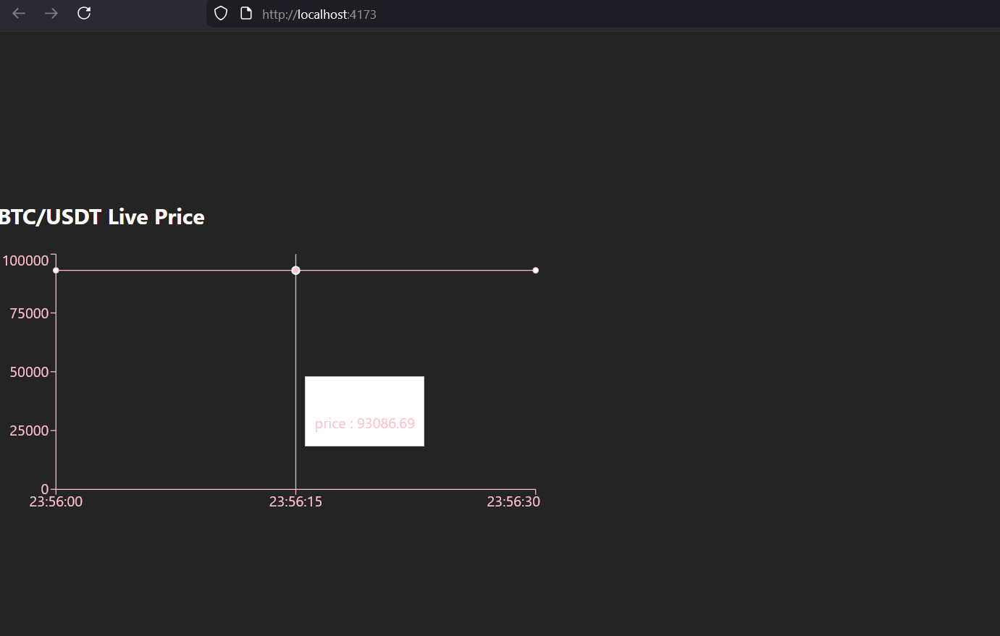

# 🚀 Crypto Price Tracker

**Crypto Price Tracker** is a microservice application that fetches cryptocurrency prices from the Binance API, caches them with Redis and stores them in PostgreSQL database. It can be easily run with Docker Compose and provides live prices and charts on the frontend via WebSocket.
.



---

## 1️⃣ Project Purpose

- Fetch crypto prices from Binance API
- Provide fast access by caching with Redis
- Log price history to PostgreSQL
- Launch all services with Docker Compose
- Fetch prices at specific intervals with scheduler container
- Display live prices and charts on frontend via WebSocket

---

## 2️⃣ System Architecture and Services

### 2.1 Backend API
- Node.js & NestJS based
- Fetches prices and stores them in PostgreSQL and Redis
- Returns latest prices as JSON via `/prices` endpoint
- Sends live data to frontend via WebSocket


### 2.2 Database
- PostgreSQL (Docker container)  
- `price_logs` table:  
  | Kolon | Tip | Açıklama |
  |-------|-----|----------|
  | id | SERIAL PRIMARY KEY | Unique ID |
  | symbol | VARCHAR | Crypto Symbol (BTCUSDT) |
  | price | DECIMAL | Price |
  | timestamp | TIMESTAMP | Data fetch time |

### 2.3 Cache
- Redis (Docker container)
- Used for fast access to latest prices


### 2.4 Scheduler / Worker
- Separate container to fetch prices at specific intervals
- Provides automatic updates with cron-job like functionality

---

## 3️⃣ Docker Compose Structure

```yaml
version: "3.9"
services:
  db:
    image: postgres:16
    container_name: crypto-db
    environment:
      POSTGRES_USER: postgres
      POSTGRES_PASSWORD: password
      POSTGRES_DB: cryptodb
    ports:
      - "5432:5432"
    volumes:
      - pgdata:/var/lib/postgresql/data

  redis:
    image: redis:7
    container_name: crypto-redis
    ports:
      - "6379:6379"

  backend:
    build: ./backend
    container_name: crypto-backend
    env_file: ./backend/.env
    depends_on:
      - db
      - redis
    ports:
      - "4000:4000"

  worker:
    build: ./worker
    container_name: crypto-worker
    env_file: ./worker/.env
    depends_on:
      - db
      - redis

volumes:
  pgdata:
```
## 4️⃣ .env Example

**backend/.env & worker/.env**

```dotenv
DATABASE_URL="postgresql://postgres:password@db:5432/cryptodb"
REDIS_HOST="redis"
REDIS_PORT=6379
BINANCE_API_URL="https://api.binance.com/api/v3/ticker/price"
SCHEDULE_INTERVAL=10   # saniye cinsinden
```

## 5️⃣ Installation & Running

### Clone the repo:
```bash
git clone <repo-url>
cd <repo-folder>
```

Launch services with Docker Compose:
```bash
docker-compose up --build
```

Access Backend API:
```bash
http://localhost:4000/prices
```

Open frontend to view live prices and live chart:
```
http://localhost:4173
```

## 6️⃣ Technologies

Backend: Node.js, NestJS

Database: PostgreSQL

Cache: Redis

Messaging / Scheduler: Worker container, cron-like

Frontend: WebSocket, Live Chart

Containerization: Docker, Docker Compose

## 7️⃣ Features
- Automatic price updates at specific intervals
  
- Fast access with Redis cache
  
- Live data stream to frontend via WebSocket
  
- Chart display with live chart
  
